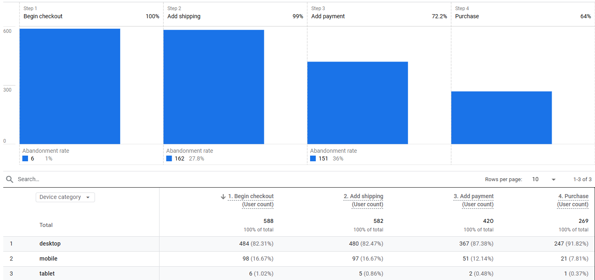
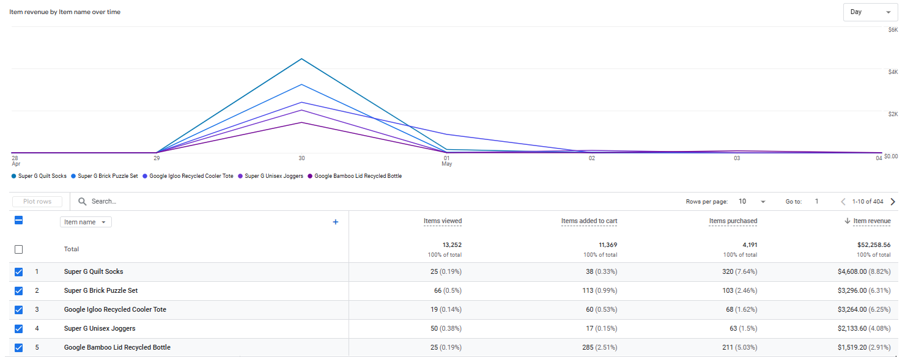
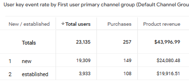
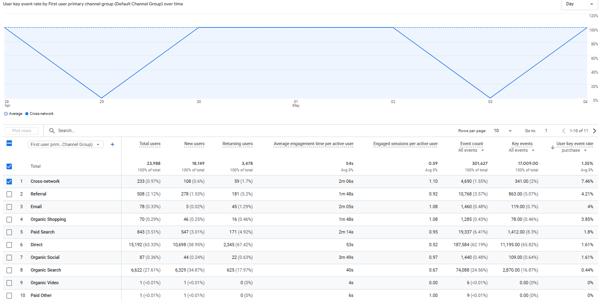

# Report insights and summary 

Last week, the checkout process saw a 46% completion rate, with the highest abandonment occurring at the payment information step. Mobile users converted at less than half the rate of desktop users (21.4% vs. 51%) among those who began checkout.
The Super G quilt socks was the top performing product by revenue, followed by the Brick puzzle set and Cooler tote. Although new users generated more traffic and revenue than returning users, their purchase CR was significantly lower (0.77% vs. 2.75%).
For acquisition channels, Cross-network delivered the highest purchase CR at 7.46%, while referral and email also performed well. In contrast, Organic search and direct drove the most traffic but underperformed in both engagement and CR. 

# Questions 

- Where are users dropping off in the checkout process and does device type impact completion rates?

- Which products drove the most revenue last week?

- How do new and returning users compare in terms of purchase conversion rates and revenue?

- Which channels brought in the highest quality users based on engagement and conversion?

# Report 

Last week, 269 users (46%) completed a purchase out of 588 users who began the checkout process. The largest drop-off occurred at the add payment step, where 151 users exited before entering their payment details. Among 484 desktop users, 51% completed the purchase, whereas only 21.4% of mobile users did so. For users who reached the shipping stage, 76% of desktop users proceeded to the payment step, compared to just 51% of mobile users.

These results suggest that mobile users are significantly more likely to abandon the checkout process at the payment stage and have a lower general purchase completion rate compared to desktop users.

The Super G Quilt Socks led all products in revenue, generating $4,608 from 320 purchases. Additionally, the Super G Brick puzzle set and Google igloo recycled cooler tote generated $3,296 and $3,264 in revenue respectively.

New users generated more traffic (19,309 users vs. 3,933) and  more total revenue ($24,080 vs. $19,916). However, new users purchase conversion rate was significantly lower, where  new users converted at approx. 0.77%, compared to 2.75% for established users.

Cross-network traffic delivered the highest purchase CR at 7.46% and representing less than 1% of total users. Referral and email also performed well, with purchase CR above 4% and average engagement times above 1m 45s. In contrast, Organic search and Direct brought in the majority of users but showed lower purchase CR and shorter engagement times.

